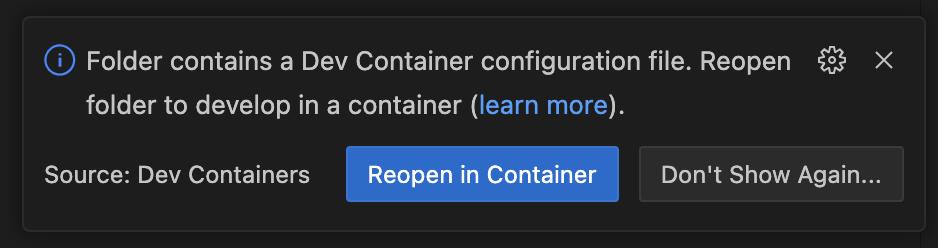

# Developer Setup

### Requirements
‼️ You need to install ALL of the required software below before continuing!

1. Any device running MacOS: i.e. a MacBook Pro / MacBook Air / Mac Mini / Mac Studio / iMac. The setup instructions below may also work on Linux, but they aren't tested on that platform.
2. [Git](https://git-scm.com/downloads/mac)
3. [Docker desktop](https://www.docker.com/products/docker-desktop/)
4. [VSCode](https://code.visualstudio.com/) with the [Dev Containers](https://marketplace.visualstudio.com/items?itemName=ms-vscode-remote.remote-containers) extension installed
5. [BitWarden CLI](https://bitwarden.com/help/cli/)


***


### Instructions

1. Open a terminal (either the MacOS terminal or a terminal window in VSCode) and run the following commands:
```bash
git clone git@github.com:commonknowledge/mapped.git
cd mapped
bin/download_env_files.sh
```

2. If you haven't already done so, open the project folder in VSCode (File menu -> Open folder). You will receive a notification like this:
 Click "reopen in container". If that doesn't happen, press `Cmd+Shift+P` to open the command palette, and type "reopen in container" to find
   the "Dev Containers: Reopen in Container" option.

3. Wait for the Dev Containers to set up. This will take less than 10 minutes.

4. In the "Run and Debug" section of the VSCode left-hand navigation, click the "Run Mapped!" configuration to start the Mapped
   application.

5. Visit http://localhost:3000 in your browser to access Mapped.


***


### Feature Showcase

1. Log in to the Mapped [front end](localhost:3000/login). The username and password are `admin` and `password`.
2. There are 3 available data sources: "Seed Member List", "Seed Custom Data", and "Seed Events".
3. The "Seed Member List" data source has a mapping that populates the Constituency and Element fields in the AirTable.
4. There is a map report called "Test map report" displaying constituencies and MPs.
5. The hub is available at [hub.localhost:3000](http://hub.localhost:3000).
6. The hub has some minimal content on the homepage, and a working pledge map.
7. You can edit the hub through the Mapped dashboard (i.e. [localhost:3000/hub/editor](http://localhost:3000/hub/editor)).

You can also log in to the [Django](http://127.0.0.1:8000/admin) and [Wagtail](http://127.0.0.1:8000/cms) admin systems. The
username and password are `admin` and `password`.


***


### Detailed documentation
Wiki coming soon...
In the meantime, you can find some more documentation and troubleshooting instructions [here](CONTRIBUTING.md).